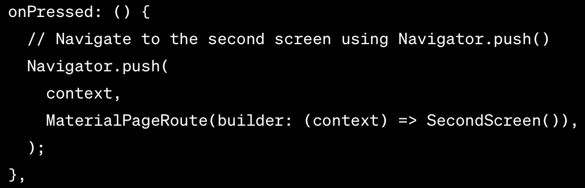
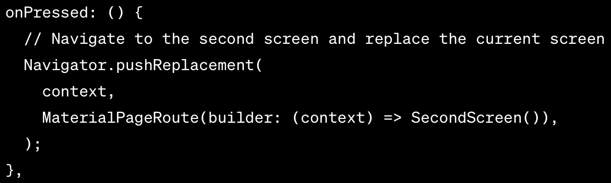

# Assignment 7

### What are the main differences between stateless and stateful widget in Flutter?
Stateless widgets only have one unchanging state. Stateful widgets have more than one state, which allows them to maintain and update their internal state.

### Explain all widgets that you used in this assignment.
* MaterialApp: This is the root widget for a Flutter application.
* MyHomePage: Is a statelesswidget
* ItemCard: Is a stateless widget
* SingleChildScrollView: A widget that provides a scrollable view for its child, allowing you to scroll through content that doesn't fit on the screen.
* Padding: A widget used to add padding (empty space) around its child widgets to control their spacing and layout.
* Column: A layout widget that arranges its children in a vertical column, one below the other.
* Text: A widget used to display text in your app. You can customize the text's style, color, and more using properties like textAlign, style, and textDirection.
* GridView: A widget that creates a scrollable grid of items. It's useful for displaying a collection of widgets in a grid layout.
* GridView.count: A specific variation of the GridView widget that creates a grid with a fixed number of columns.
* Material: A basic rectangular material design widget that is often used as the background for other widgets, such as cards.
* Inkwell: A widget used to make its child interactive by adding ink splash effects when it's tapped.
* SnackBar: A widget that displays a brief message at the bottom of the screen. It's often used for showing notifications or alerts to the user.
* Icon: A widget for displaying icons from the material design icon set or custom icons using IconData.
* Container: A versatile widget for creating a rectangular visual element that can be used to contain other widgets. It's often used for layout and styling purposes.
* AppBar: A widget representing the app bar at the top of the screen, typically used for navigation and displaying the app's title and actions.
* Scaffold: A basic structure for an app's UI that provides common visual elements like app bars, drawers, and a floating action button. It helps organize the app's layout.

### How do you implement the tasks in the checklist?

* __Create a new Flutter application with the inventory theme:__ 
To create a Flutter application I used the command flutter create cardco, and navigated to it with cd cardco. Then I initialized the local git repository and linked it to the remote one.
* __Create 3 simple buttons with icon and text:__ 
The MyHomePage class creates a Scaffold that includes an app bar and a GridView for displaying the card buttons. The GridView uses the CardItem objects to create a grid of buttons, and the ItemCard class defines the appearance and behavior of each button within the grid.
* __Create a SnackBar with texts__ 
  When a button is tapped, an InkWell is used to provide visual feedback, and a SnackBar is displayed at the bottom of the screen, showing a message indicating which button was clicked.

# Assignment 8

### Explain the difference between Navigator.push() and Navigator.pushReplacement(), accompanied by examples of the correct usage of both methods!

Navigator.push() is used to push a new route onto the navigation stack. Navigator.pushReplacement() is used when you want to push a new route onto the stack and replace the current route with the new one.

### Explain each layout widget in Flutter and their respective usage contexts!

The following layout widgets are the ones used in this assignment:
* Container is often used to control the size, padding, margin, and decoration of its child widgets.
* Align is used to align its child within its bounds.
* Padding adds padding around its child widget.
* Column is a flex container that arranges its children vertically in a single column.
* ListView is used to create a scrollable list of widgets.
* GridView is used to create a scrollable 2D array of widgets.

### List the form input elements you used in this assignment and explain why you used these input elements!

The form input element I used is the TextFormField because I only need to save my data as strings for now.

### How is clean architecture implemented in a Flutter application?

"Clean Architecture is a software design principle that promotes the separation of concerns and aims to create a modular, scalable, and testable codebase" (Medium). In flutter, clean architecture is implemented using three layers: The presentation layer handles the UI (widgets, screens, and views); The domain layer handles the business logic (use cases, entities, and business rules); The data layer handles data retrieval and storage.
Reference: https://medium.com/@samra.sajjad0001/flutter-clean-architecture-5de5e9b8d093

### How do you implement the tasks in the checklist?

* __Create at least one new page in the application, a page for adding a new item with the following requirements:__ 
To create a new page, I created a new screen called itemlist_form.dart.
* __Use at least three input elements: name, amount, description:__ 
I used the TextFormField layout widget for these three input elements.
* __Have a Save button:__ 
When the save button is clicked, it validates the users input, saves the data, shows a popup widow of the data, and clears the input form so the user can add more items.
* __Each input element must not be empty:__ 
To make sure that the input elements are not empty, I used a validator and method .isNull.
* __Each input element must contain data of the same data type as its model attribute:__ 
To make sure that the input elements contain data of the same data type as their model attributes, I used a validator to parse the amount input to check for an integer.
* __Direct users to the new item addition form page when clicking the Add Item button on the main page:__ 
To direct users to the new item addition form page when clicking the Add Item button on the main page, I pushed the ItemFormPage on to the navation stack with the onTap event.
* __Display data as entered in the form in a pop-up after clicking the Save button on the new item addition page:__ 
To make the pop-up after clicking the save button, I used the showDialog function to display the data.
* __Create a drawer in the application:__ 
To create a drawer, I used the drawer widget's header to add a title and description. The drawer child is a li
* __The drawer must have at least two options: Home and Add Item:__ 
The drawer child is a ListView class with children ListTiles, where each ListTile has a name and navigates to their respective pages.
* __When choosing the Home option, the application will direct the user to the main page:__ 
To achieve this, the ListTile has an onTap() event that pushes the main page onto the naviation stack.
* __When choosing the Add Item option, the application will direct the user to the new item addition form page:__ 
Similarly, this ListTile has an onTap() event that pushes the Add Item page onto the naviation stack.